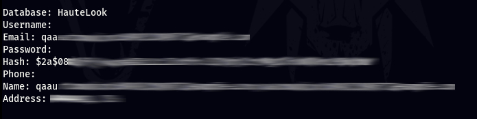

# Godehashed
A golang tool that uses the dehashed.com API to search for compromised assets. Results can then be compiled into a CSV for further analysis.

## Screenshot



## Dehashed API

You must supply the tool an api key. See apikey_template.txt for example.
Use with switch ./godehashed -s email -i apikey.txt -e SOMEDOMAIN -o leaks.csv

## Installation

To install the tool in CLI run the following command. Your $GOPATH must already be set.
```go get https://github.com/an00byss/godehashed```

## Usage

```
Usage():
-e string  
Email we are searching for  
-i string  
Name of apikey to import.  
-n string  
Name we are searching for.  
-o string  
Outfile file name, will output in CSV Format.  
-p int  
Phone number we are searching for  
-s string  
Specify what we are searching for: "name", "email" or "username". Then add corresponding switch.  
-u string  
Username we are searching for
```

## Notice

```
[!] Legal disclaimer: Usage of godehashed for attacking targets without
prior mutual consent is illegal. It is the end user's responsibility
to obey all applicable local, state and federal laws. Developers assume
no liability and are not responsible for any misuse or damage caused.
```


